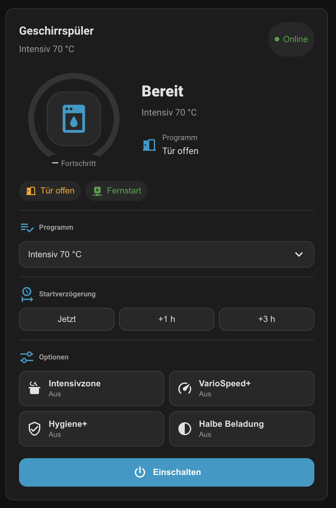

# Home Connect Dishwasher Card

A standalone Home Assistant dashboard card for [Home Connect](https://www.home-assistant.io/integrations/home_connect/) dishwashers.

<picture>
  
</picture>

## Features

- Automatic Home Connect entity discovery from a Home Assistant `device_id`
- Operation state, programme, progress, finish time, connectivity, remote-start and door status
- Programme selection, start-delay presets and dishwasher options
- Power-on and confirmed programme-stop actions
- Responsive layout with reduced-motion support
- German and English labels, with programme names translated by Home Assistant
- No frontend-card dependencies

## Compatibility

The supported minimum is **Home Assistant 2026.6.0 or newer**. The card has been tested with a **Siemens iQ300 dishwasher** using the Home Connect integration. It should also work with other Home Connect dishwashers that expose the corresponding standard entities. Available controls and status fields depend on the capabilities and enabled entities of the individual appliance.

## Installation

### HACS

1. Open HACS.
2. Add this repository as a custom repository with category **Dashboard**.
3. Install **Home Connect Dishwasher Card**.
4. Reload the browser.

HACS installs the resource as:

```text
/hacsfiles/homeassistant_custom_dishwasher_card/homeassistant_custom_dishwasher_card.js
```

### Manual

Copy `dist/homeassistant_custom_dishwasher_card.js` to Home Assistant and register it as a JavaScript module.

## Configuration

```yaml
type: custom:dishwasher-card
device_id: 0123456789abcdef0123456789abcdef
title: Geschirrspüler
```

The card discovers the Home Connect entities attached to the device. Entity IDs can also be supplied explicitly:

```yaml
type: custom:dishwasher-card
title: Geschirrspüler
entities:
  operation: sensor.geschirrspuler_operation_state
  progress: sensor.geschirrspuler_program_progress
  finish: sensor.geschirrspuler_program_finish_time
  selectedProgram: select.geschirrspuler_selected_program
  door: sensor.geschirrspuler_door
  connectivity: binary_sensor.geschirrspuler_connectivity
```

Optional settings:

```yaml
type: custom:dishwasher-card
device_id: 0123456789abcdef0123456789abcdef
accent_color: var(--primary-color)
language: en
show_program: true
show_delay: true
show_options: true
program_names:
  dishcare_dishwasher_program_auto_2: Auto
```

### Programme names

Programme names come from Home Assistant itself: the card asks the frontend to format the
`select`/`sensor` state, so the Home Connect integration's own translations are used in the
language configured in Home Assistant. Only when Home Assistant has no translation for an
option does the card fall back to its built-in name list, and then to the prettified raw value.

`language` forces the card's own labels (`de` or `en`) instead of following the Home Assistant
frontend language. It does not affect programme names, which Home Assistant translates.

`program_names` overrides individual programmes and takes precedence over every other source.
Keys may be either the raw entity state or the name the card would display:

```yaml
program_names:
  # by raw state
  dishcare_dishwasher_program_quick_65: Quick 65 °C
  # by displayed name
  Maschinenpflege: Machine care
  Vorspülen: Pre-rinse
```

## Requirements

- Home Assistant 2026.6.0 or newer
- The [Home Connect](https://www.home-assistant.io/integrations/home_connect/) integration configured
- The relevant entities enabled in the entity registry

## Development

```bash
npm ci
npm test
npm run build
```

`npm run build` validates the source and writes the HACS distribution file.

Detailed development, architecture, compatibility, and operational guidance is available
in [docs/index.md](docs/index.md).

## Release process

1. Merge releasable Conventional Commits into `main`.
2. Release Please creates or updates the release pull request and keeps all version sources aligned.
3. Merge the release pull request after Jenkins, HACS and Dependency Review are green.
4. The resulting version tag publishes `dist/homeassistant_custom_dishwasher_card.js` as the GitHub release asset.

## Support

Use GitHub Issues for bug reports and feature requests. Security issues should follow [SECURITY.md](SECURITY.md).

## License

MIT
