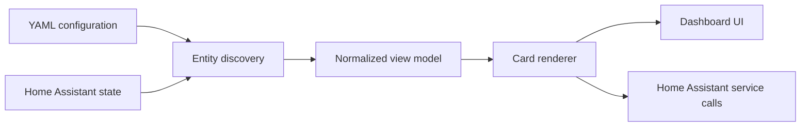

# Container diagram

```mermaid
flowchart LR
    Config[YAML configuration] --> Discovery[Entity discovery]
    HAState[Home Assistant state] --> Discovery
    Discovery --> Model[Normalized view model]
    Model --> Renderer[Card renderer]
    Renderer --> Browser[Dashboard UI]
    Renderer --> Services[Home Assistant service calls]
```
