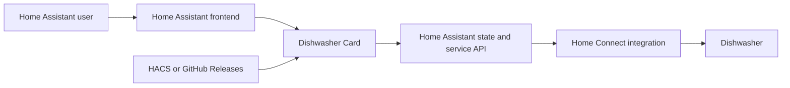

# System context diagram

```mermaid
flowchart LR
    User[Home Assistant user] --> HA[Home Assistant frontend]
    HA --> Card[Dishwasher Card]
    Card --> API[Home Assistant state and service API]
    API --> HC[Home Connect integration]
    HC --> Appliance[Dishwasher]
    HACS[HACS or GitHub Releases] --> Card
```
